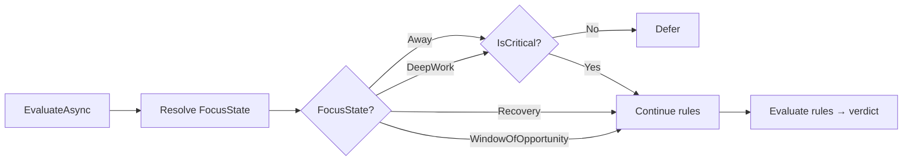

# Design: W3-H3 — Focus State Resolution & Blackout Periods

## Technical Approach

Replace the stub `FocusStateResolver` (always `WindowOfOpportunity`) with a **signal-based resolver** in Infrastructure that chains calendar events, blackout periods, and time-of-day heuristics. Signal priority: Calendar → Blackouts → Time-of-day → Fallback. First-match-wins per spec.

The resolver is stateless — creates a new `FocusState()` each call with immediate transitions. This avoids mutable state across HTTP requests.

## Architecture Decisions

### Decision: Signal pipeline runs in Infrastructure layer

| Option | Tradeoff | Decision |
|--------|----------|----------|
| Application-only | Pure logic, no I/O | ❌ — needs `ICalendarEventStore` and config |
| Domain | Testable, no I/O | ❌ — Domain cannot depend on Infrastructure ports |
| **Infrastructure** | Full adapter access, follows `InterruptionPolicyEngine` pattern | ✅ |

### Decision: `BlackoutPeriod` as Domain value object

Blackout rules encode domain policy (recurring DeepWork blocks, lunch). Placing it in Domain enforces validation invariants (`StartTime < EndTime`, valid `DaysOfWeek`) at the model boundary, not in config parsing.

### Decision: `UserId` added to `CalendarEvent` record

`ICalendarEventStore.GetUpcomingAsync` lacks user scoping. Adding `UserId` to the domain record enables per-user filtering without a new port method. Calendar events are already user-scoped from delegated Graph tokens — this makes the scope explicit.

### Decision: `InterruptionPolicyEngine` gating extended, not refactored

Current engine gates only `Away` → Defer non-critical. Adding `DeepWork` → Defer non-critical (same gate) and `Recovery` → treat as `WindowOfOpportunity` extends the existing focus state check. No structural refactor needed.

## Data Flow

### Signal Resolution Pipeline

```mermaid
flowchart TD
    A[ResolveAsync userId] --> B[Query CalendarEvents\nutcNow-buffer to utcNow+buffer]
    B --> C{Any event overlapping?}
    C -->|Yes| D[FocusState.GoToAway\n→ return Away]
    C -->|No| E[Check BlackoutPeriods\nconvert to UTC]
    E --> F{Active blackout?}
    F -->|DeepWork| G[FocusState.TryEnterDeepWork\n→ return DeepWork]
    F -->|Away| D
    F -->|No match| H{utcNow within\nWorkingHours?}
    H -->|No| D
    H -->|Yes| I[→ return WindowOfOpportunity\n(fallback)]
```

### Interruption Policy Gating



## File Changes

| File | Action | Description |
|------|--------|-------------|
| `src/Aura.Domain/FocusState/BlackoutPeriod.cs` | Create | Value object: Label, TargetState, StartTime (TimeOnly), EndTime, DaysOfWeek, TimeZoneId |
| `src/Aura.Domain/Calendar/CalendarEvent.cs` | Modify | Add `string? UserId = null` to record |
| `src/Aura.Infrastructure/Adapters/Options/FocusStateOptions.cs` | Create | Config model: BlackoutPeriods[], WorkingHoursStart/End, MeetingBufferMinutes |
| `src/Aura.Infrastructure/Adapters/Services/SignalBasedFocusStateResolver.cs` | Create | Signal pipeline impl of IFocusStateResolver |
| `src/Aura.Infrastructure/Adapters/Services/InterruptionPolicyEngine.cs` | Modify | DeepWork gate (defer non-critical), Recovery → pass through |
| `src/Aura.Infrastructure/Adapters/Connectors/Calendar/CalendarEventMapper.cs` | Modify | Map UserId from Graph DTO |
| `src/Aura.Infrastructure/Adapters/Connectors/Calendar/InMemoryCalendarEventStore.cs` | Modify | Filter by userId if present |
| `src/Aura.Infrastructure/DependencyInjection.cs` | Modify | Add SignalBasedFocusStateResolver + FocusStateOptions binding |
| `src/Aura.Application/Services/FocusStateResolver.cs` | Delete | Stub no longer needed |
| `src/Aura.Application/DependencyInjection.cs` | Modify | Remove `AddScoped<IFocusStateResolver, FocusStateResolver>()` |
| `src/Aura.Api/Endpoints/FocusStateEndpoints.cs` | Create | `GET /api/focus-state/current` |
| `src/Aura.Api/Program.cs` | Modify | Map focus state endpoints |
| `src/Aura.Api/appsettings.json` | Modify | Add `FocusState` config section |
| `src/Aura.UI/Services/IFocusStateApiClient.cs` | Create | API client interface |
| `src/Aura.UI/Services/FocusStateApiClient.cs` | Create | HTTP client impl |
| `src/Aura.UI/Components/Dashboard/FocusStatePanel.razor` | Create | State badge with color + icon |
| `src/Aura.UI/Pages/Index.razor` | Modify | Add `<FocusStatePanel />` |

## Interfaces / Contracts

```csharp
// Domain — new value object
public sealed record BlackoutPeriod(
    string Label,
    FocusStateType TargetState, // DeepWork or Away only
    TimeOnly StartTime,
    TimeOnly EndTime,
    IReadOnlyList<DayOfWeek> DaysOfWeek,
    string TimeZoneId)
{
    public bool IsActive(DateTimeOffset utcNow, TimeProvider timeProvider);
}

// CalendarEvent — modified record
public sealed record CalendarEvent(
    string Id, string Title,
    DateTimeOffset StartUtc, DateTimeOffset EndUtc,
    bool IsOnlineMeeting,
    string? JoinUrl = null, string? Organizer = null,
    string? Location = null, string? OriginalTimeZone = null,
    string? UserId = null);  // ← added

// Infrastructure — config model
public sealed class FocusStateOptions
{
    public const string SectionName = "FocusState";
    public TimeOnly WorkingHoursStart { get; set; } = new(8, 0);
    public TimeOnly WorkingHoursEnd { get; set; } = new(18, 0);
    public int MeetingBufferMinutes { get; set; } = 5;
    public IReadOnlyList<BlackoutPeriodDto> BlackoutPeriods { get; set; } = [];
}

// API response
public sealed record FocusStateResponse(
    string UserId,
    string CurrentState,
    string? Label,      // blackout label if applicable
    DateTime Since);
```

## Testing Strategy

| Layer | What | Approach |
|-------|------|----------|
| Domain | `BlackoutPeriod.IsActive` with timezone/day-of-week edge cases | Unit: TimeOnly/weekday/UTC crossing |
| Domain | `CalendarEvent` record still compiles with new field | Unit: positional constructor |
| Infra | `SignalBasedFocusStateResolver` signal pipeline | Unit: mock `ICalendarEventStore` + `TimeProvider`, test all 4 states |
| Infra | `InterruptionPolicyEngine` DeepWork + Recovery gating | Unit: existing test suite extended with new focus states |
| Infra | `FocusStateOptions` binding | Unit: JSON deserialization round-trip |
| API | `GET /api/focus-state/current` auth + response shape | Integration: `WebApplicationFactory` |
| UI | `FocusStatePanel` renders with colour | E2E / component test |
| E2E | Full flow: seed event → API returns Away → panel shows red | Manual/TBD |

**Test command**: `dotnet test Aura.sln` (TDD mode — write RED test first, then implement).

## Telemetry

- `ActivitySource("Aura.Infrastructure.FocusState")` in `SignalBasedFocusStateResolver`
- Span `SignalBasedFocusStateResolver.ResolveAsync` with tags: `userId`, `matched_signal`, `focus_state`
- Log warning when no calendar store match found (expected for empty users, noisy for seeded data)

## Migration / Rollout

No data migration required. `UserId` is additive on a record. Configuration is new-only. The DI swap (stub → real) is atomic at service registration. Rollback: revert DI registrations + appsettings, remove endpoint/component, delete new files.

## Risks

| Risk | Mitigation |
|------|------------|
| Timezone errors in blackout UTC conversion | `BlackoutPeriod.IsActive` stores UTC offset computed from `TimeZoneId` + `TimeProvider` |
| Calendar store returns stale/empty data | Document as dev limitation; dogfood with persistent store before GA |
| `FocusState` transition guard throws on direct state construction | Resolver calls `GoToAway()`/`TryEnterDeepWork()` — valid transitions from default `WindowOfOpportunity` |
| DeepWork gate duplicates Away gate logic | Extract `ApplyFocusStateGate()` private method in `InterruptionPolicyEngine` |

## Open Questions

- [ ] Should `BlackoutPeriod.TimeZoneId` be validated against IANA/Windows time zone names? — separate concern for config validation.
- [ ] `FocusStateResponse.Since` — is it the start of the current applied signal? Deferred: return `DateTimeOffset.UtcNow` initially.
